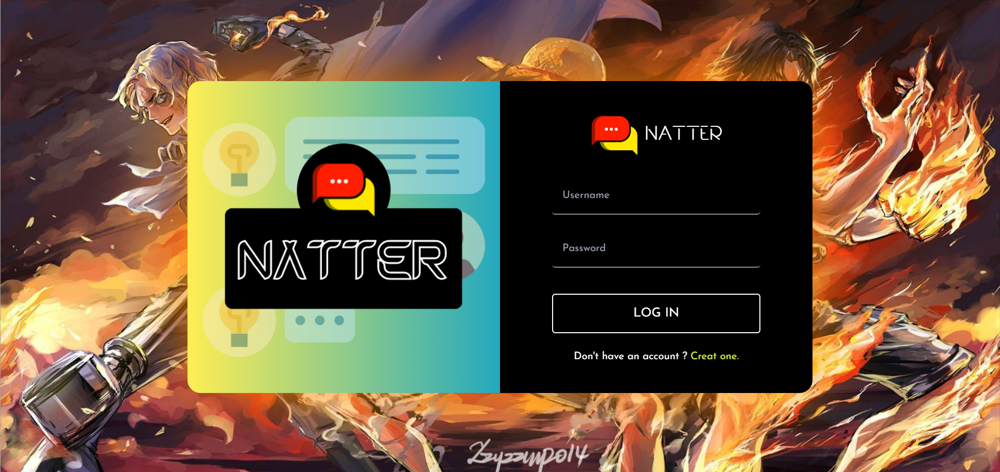
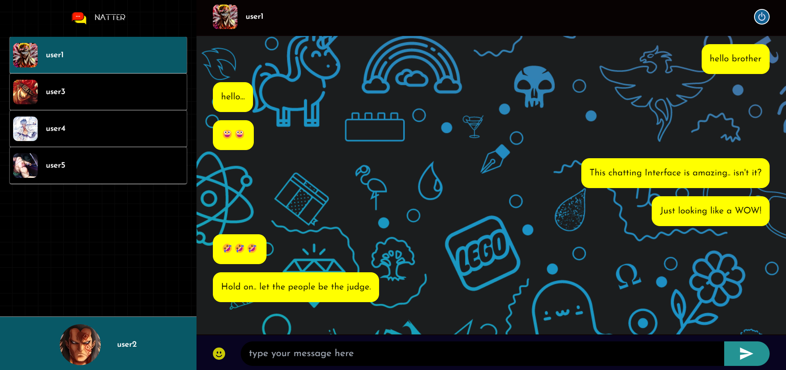

# NATTER

NATTER is a cutting-edge chat application designed using MERN stack and Socket.io. With its features
and user-friendly interface, NATTER allows users to easily connect with one another and engage in realtime conversations. NATTER is an end-to-end encrypted chatting application with proper user
authentication.

## Snapshot:


<blockquote><b><i>login page</i></b></blockquote>



<blockquote><b><i>welcome page</i></b></blockquote>


<blockquote><b><i>chatting page</i></b></blockquote>



## Technology Used:

1. **ReactJS**
2. **NodeJS**
3. **express.js**
4. **MongoDB**
5. **Styled Components**


## Try out the Live Link
https://natter-liart.vercel.app
<blockquote><i>In 2 to 3 days the link will be fully functional.</i></blockquote>


## Getting Started

1. Clone both the repository to your local machine:

```bash
git clone https://github.com/ParamPragyan/Natter.git
git clone https://github.com/ParamPragyan/Natter-backend.git
```

2. Navigate to the project's directory:

```bash
cd Natter
cd Natter-backend
```

3. Install dependencies using npm:

```bash
npm install
```

<br>

## Running the App

To run the app in development mode, use the following command in both the repository:

```bash
npm start
```

<br>

## Credentials:
```bash
login: user3
password: 123456
```

## Checkout the repository:
https://github.com/ParamPragyan/Natter-backend
